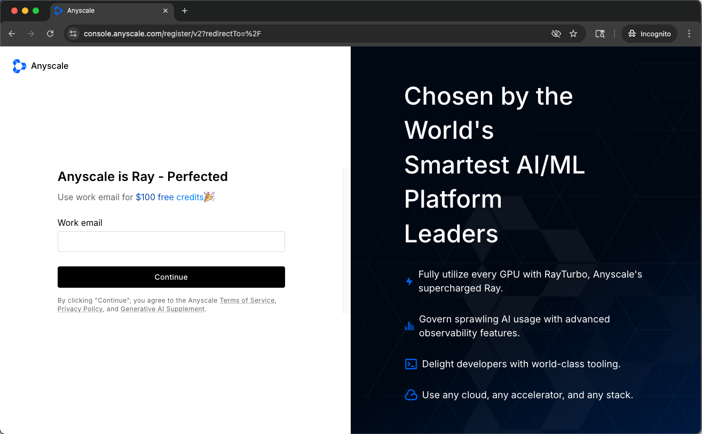
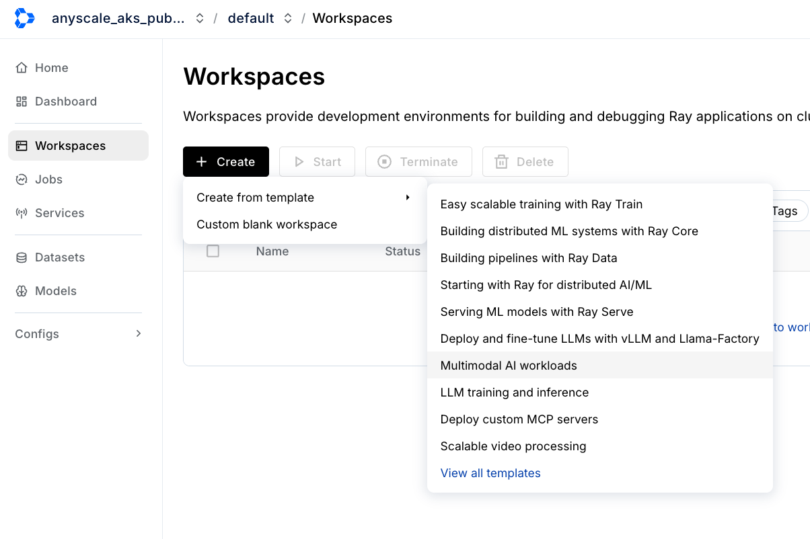
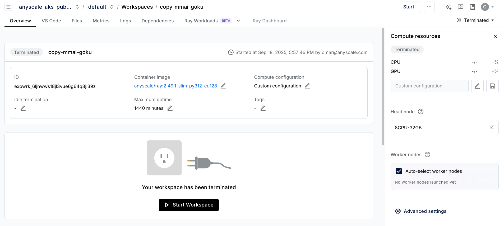
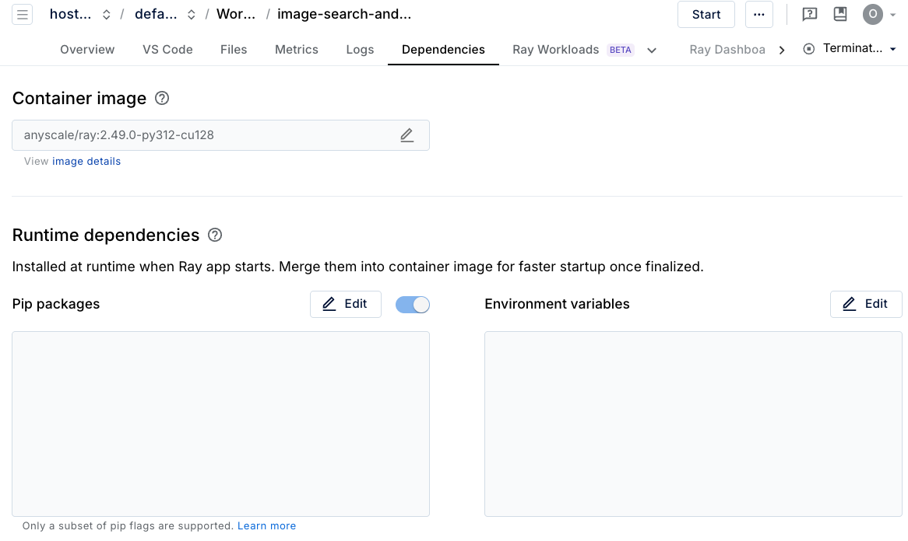

# Anyscale on AKS Demo Guide

**Audience:** Microsoft Field Engineers
**Goal:** Provide guidance on how to demo Anyscale on AKS functionality

---

## Table of Contents

- [Prerequisites](#prerequisites)
- [Demo 1: Multi-modal Batch Inference](#demo-1-multi-modal-batch-inference)
  - [Preparation](#preparation)
  - [Demo Execution](#demo-execution)
- [Demo 2: Deploy LLMs](#demo-2-deploy-llms)
  - [Preparation](#preparation-1)
  - [Demo Execution](#demo-execution-1)
- [Tips for a Successful Demo](#tips-for-a-successful-demo)
- [Support](#support)

---

## Prerequisites

### Step 1: Request Access
Contact [msftdemos@anyscale.com](mailto:msftdemos@anyscale.com) for access credentials to the demo Anyscale organization.

### Step 2: Login
Navigate to [console.anyscale.com](https://console.anyscale.com) and sign in with your credentials.



---

## Demo 1: Multi-modal Batch Inference

### Preparation

1. **Launch a workspace with Multi-Modal AI template**
   - From the Anyscale console, create a new workspace
   - Select the "Multi-Modal AI" template

   

2. **Modify compute configuration**
   - **Terminate the workspace** (if already running)
   - Navigate to compute configuration settings

   

   - **Change the head node:**
     - From: `2CPU-8GB`
     - To: `8CPU-32GB`
   - **Change the worker nodes:**
     - From: `Auto-select workers`
     - To: `4 x T4` GPUs

   

3. **Modify the container image**
   - Select image "anyscale/ray:2.49.1-py312-cu128"
4. **Re-launch the workspace**
   - Start the workspace with the new configuration

### Demo Execution

- Access notebooks/01-Batch-Inference.ipynb
- **[Optional]** Modify the Batch Inference notebook to use Azure Blob Storage instead of S3
  - This demonstrates cloud-native integration with Azure services
  - Update storage connection strings and authentication as needed

```
import pyarrow.fs as pafs
account_name=""
azure_fs = pafs.AzureFileSystem(
    account_name=account_name,
)
ds = ray.data.read_images(
    "abfs://doggos-dataset/train",
    include_paths=True,
    shuffle="files",
    filesystem=azure_fs
)
ds.take(1)
```
- Run through the notebook until "Monitoring and Debugging"

---

## Demo 2: Deploy LLMs

### Preparation

1. **Launch a workspace with Deploy LLMs template**
   - From the Anyscale console, create a new workspace
   - Select the "Deploy LLMs" template

   

2. **Modify compute configuration**
   - **Terminate the workspace** (if already running)
   - Navigate to compute configuration settings
   - **Change the head node:**
     - From: `2CPU-8GB`
     - To: `8CPU-32GB`
   - **Change the worker nodes:**
     - From: `Auto-select workers`
     - To: `2 x L4` nodes

   

3. **Set up HuggingFace token**
   - Sign in to [HuggingFace](https://huggingface.co/) (create an account if required)
   - Navigate to Settings → Access Tokens
   - Create a new token with read permissions
   - Copy the token for the next step

   

4. **Configure environment variables**
   - In the Anyscale workspace settings, navigate to **Dependencies → Environment Variables**
   - Add the following environment variable:
     ```
     HF_TOKEN=<YOUR_HF_TOKEN>
     ```
   - Replace `<YOUR_HF_TOKEN>` with your actual HuggingFace token

   

5. **Acquire nodes**
   - Request node provisioning for the updated configuration

6. **Launch the workspace**
   - Start the workspace with the new configuration

### Demo Execution

- Demonstrate LLM deployment capabilities
- Show model serving and inference functionality
- Highlight integration with AKS and Azure ecosystem


---

## Tips for a Successful Demo

- Ensure nodes are provisioned before the demo to avoid wait times
- Test the workflows in advance to familiarize yourself with the UI
- Prepare talking points about AKS integration benefits
- Have backup examples ready in case of any technical issues
- Emphasize scalability and Azure-native features

---

## Support

For questions or issues, contact [omar@anyscale.com](mailto:omar@anyscale.com)
