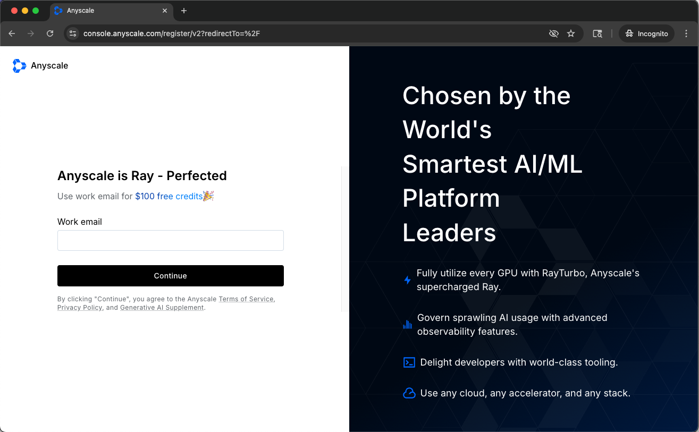
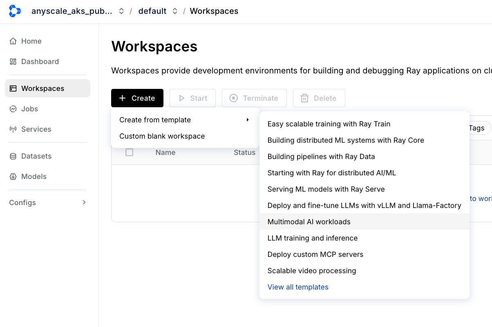
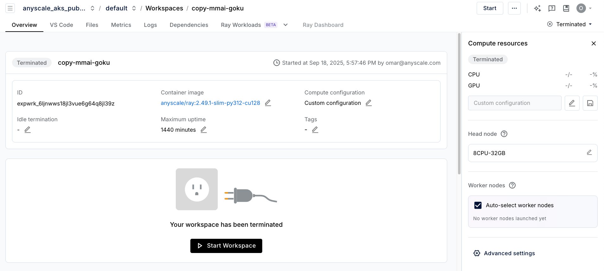
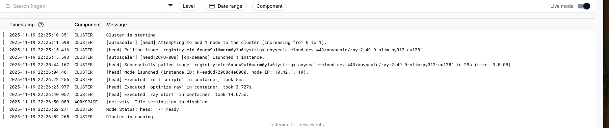
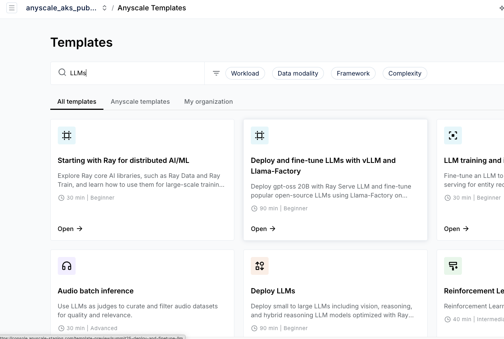
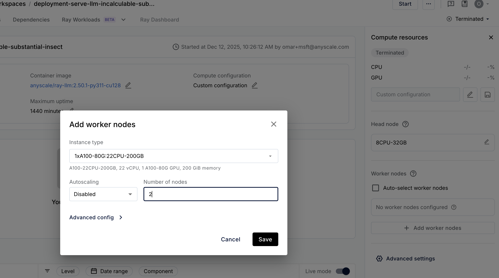
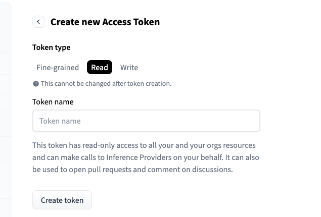
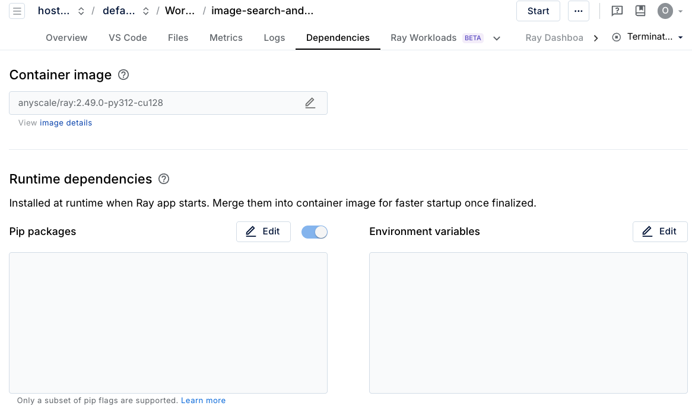

# Anyscale on AKS Demo Guide

**Audience:** Microsoft Field Engineers
**Goal:** Provide guidance on how to demo Anyscale on AKS functionality

---

## Table of Contents

- [Prerequisites](#prerequisites)
- [Demo 1: Multi-modal Batch Inference](#demo-1-multi-modal-batch-inference)
  - [Preparation](#preparation)
  - [Demo Execution](#demo-execution)
- [Demo 2: Deploy LLMs](#demo-2-deploy-llms)
  - [Preparation](#preparation-1)
  - [Demo Execution](#demo-execution-1)
- [Tips for a Successful Demo](#tips-for-a-successful-demo)
- [Support](#support)

---

## Prerequisites

### Step 1: Request Access
Contact [ms-field-collab@anyscale.com](mailto:ms-field-collab@anyscale.com) for access credentials to the demo Anyscale organization.

### Step 2: Login
Navigate to [console.anyscale.com](https://console.anyscale.com) and sign in with your credentials.



---

## Demo 1: Multi-modal Batch Inference

### Preparation

1. **Launch a workspace with Multi-Modal AI template**
   - From the Anyscale console, create a new workspace (Create from template)
   - Select the "Multi-Modal AI" template

   
   - Launch the template

2. **Modify compute configuration**
   - **Terminate the workspace** (if already running)
   - Navigate to compute configuration settings

   

   - **Change the head node:**
     - From: `2CPU-8GB`
     - To: `8CPU-32GB`
   - **Change the worker nodes:**
     - From: `Auto-select workers`
     - To: `4 x T4` GPUs

   

3. **Modify the container image**
   - Select image "anyscale/ray:2.49.1-py312-cu128"
4. **Re-launch the workspace**
   - Start the Workspace with the new configuration
   - Observe Workspace logs for successful launch. Below is an example:
   

### Demo Execution

- Navigate to the VSCode interface (not VSCode Desktop)
- Access notebooks/01-Batch-Inference.ipynb
- **[Optional]** Modify the Batch Inference notebook to use a shared storage mount
In the start of the section "Data ingestion" replace the code with a reference to S3 to:

```
# Load data.
ds = ray.data.read_images(
    "/mnt/shared_storage/doggos-dataset/train", 
    include_paths=True, 
    shuffle="files",
)
ds.take(1)
```
- Run through the notebook until the section "Monitoring and Debugging" in the notebook

---

## Demo 2: Deploy LLMs

### Preparation

1. **Launch a workspace with Deploy LLMs template**
   - From the Anyscale console, create a new workspace
   - Select the "Deploy LLMs" template

   

2. **Modify compute configuration**
   - **Terminate the workspace** (if already running)
   - Navigate to compute configuration settings
   - **Change the head node:**
     - From: `2CPU-8GB`
     - To: `8CPU-32GB`
   - **Change the worker nodes:**
     - From: `Auto-select workers`
     - To: `2 x A100` nodes

   

3. **Set up HuggingFace token**
   - Sign in to [HuggingFace](https://huggingface.co/) (create an account if required)
   - Navigate to Profile → Access Tokens
   - Create a new token with read permissions
   - Copy the token for the next step

   

4. **Configure environment variables**
   - In the Anyscale workspace settings, navigate to **Dependencies → Environment Variables**
   - Edit to Add the following environment variable:
     ```
     HF_TOKEN=<YOUR_HF_TOKEN>
     ```
   - Replace `<YOUR_HF_TOKEN>` with your actual HuggingFace token

   

5. **Launch the workspace**
   - Start the workspace with the new configuration

### Demo Execution

- Modify ```small-size-llm/notebook.ipynb``` as follows:
1. ```accelerator_type="A100",``` instead of ```accelerator_type="L4"```
1. Add your HuggingFace in the right locations (two locations)
- Modify ```small-size-llm/serve_llama_3_1_8b.py``` as follows:
. ```accelerator_type="A100",``` instead of ```accelerator_type="L4"```
- 
- Modify ```small-size-llm/service.yaml``` as follows:
```
# service.yaml
name: deploy-llama-3-8b
image_uri: anyscale/ray-llm:2.50.1-py311-cu128 # Anyscale Ray Serve LLM image. Use `containerfile: ./Dockerfile` to use a custom Dockerfile.
compute_config:
  auto_select_worker_config: true 
  head_node:
    instance_type: 8CPU-32GB
working_dir: .
cloud:
applications:
  # Point to your app in your Python module
  - import_path: serve_llama_3_1_8b:app
```
- Follow the instructions in the notebook small-size-llm/notebook.ipynb

3. Modify the serve_llama_3_1_8b.py as follows:

```python
engine_kwargs=dict(max_model_len=8192, gpu_memory_utilization=0.78)
```

```python
# serve_llama_3_1_8b.py
from ray.serve.llm import LLMConfig, build_openai_app

llm_config = LLMConfig(
    model_loading_config=dict(
        model_id="my-llama-3.1-8b",
        # Using ungated model - no HF_TOKEN required
        model_source="unsloth/Meta-Llama-3.1-8B-Instruct",
    ),
    # Use the GPU type available in your cluster:
    # - A100 for this workspace (local deployment)
    # - L4 for Anyscale Services (more commonly available)
    accelerator_type="A100",
    deployment_config=dict(
        autoscaling_config=dict(
            min_replicas=1,
            max_replicas=2,
        )
    ),
    engine_kwargs=dict(max_model_len=8192, gpu_memory_utilization=0.78),   
)
app = build_openai_app({"llm_configs": [llm_config]})
```


---

## Deploy to production with Anyscale Services

For production deployment, use Anyscale Services to deploy the Ray Serve app to a dedicated cluster without modifying the code. Anyscale ensures scalability, fault tolerance, and load balancing, keeping the service resilient against node failures, high traffic, and rolling updates.

---

### Launch the service

Anyscale provides out-of-the-box images (`anyscale/ray-llm`) which come pre-loaded with Ray Serve LLM, vLLM, and all required GPU/runtime dependencies. This makes it easy to get started without building a custom image.

Create your Anyscale Service configuration in a new `service.yaml` file:

```yaml
# service.yaml
name: deploy-llama-3-8b
image_uri: anyscale/ray-llm:2.49.0-py311-cu128 # Anyscale Ray Serve LLM image. Use `containerfile: ./Dockerfile` to use a custom Dockerfile.
compute_config:
  auto_select_worker_config: true 
working_dir: .
cloud:
applications:
  # Point to your app in your Python module
  - import_path: serve_llama_3_1_8b:app
```


Deploy your service with the following command. Make sure to forward your Hugging Face token:

```python 
anyscale service deploy -f service.yaml --env HF_TOKEN=<YOUR-HUGGINGFACE-TOKEN>
```


---

## Tips for a Successful Demo

- Ensure nodes are provisioned before the demo to avoid wait times
- Test the workflows in advance to familiarize yourself with the UI
- Prepare talking points about AKS integration benefits
- Have backup examples ready in case of any technical issues
- Emphasize scalability and Azure-native features

---

## Support

For questions or issues, contact [ms-field-collab@anyscale.com](mailto:ms-field-collab@anyscale.com)
